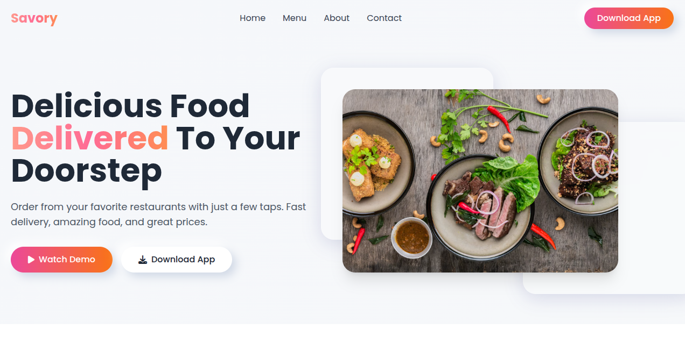
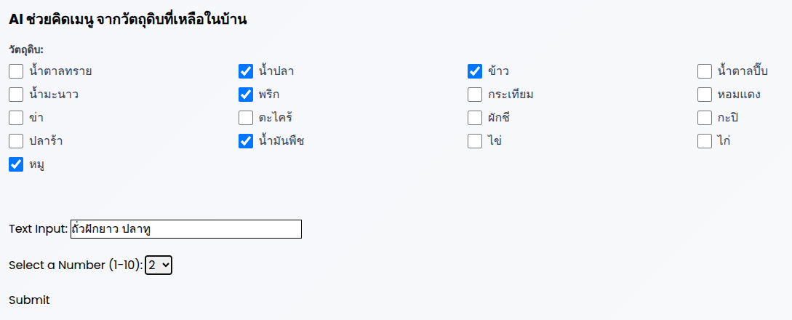
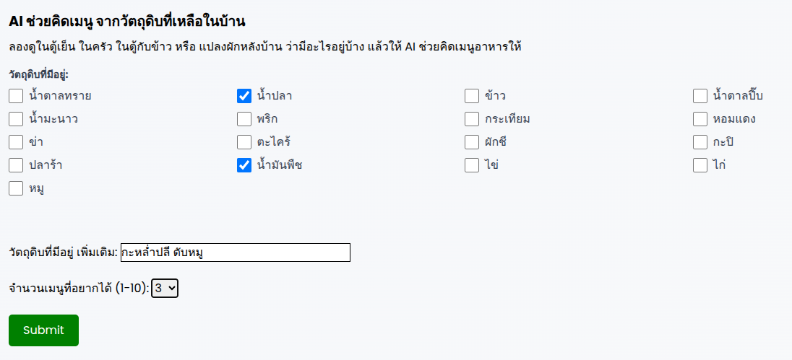
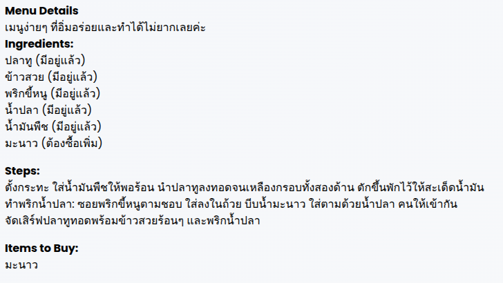
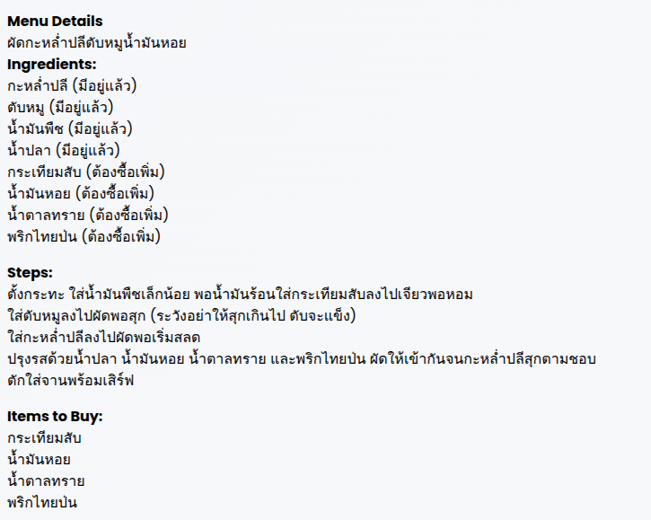
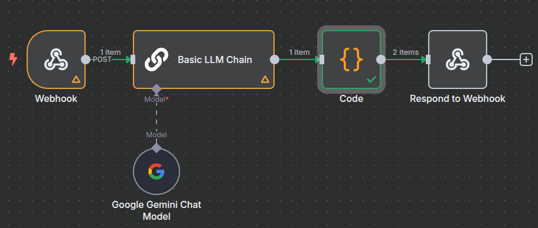

# ซอร์สโค้ดนี้ ใช้สำหรับเป็นตัวอย่างเท่านั้น ถ้านำไปใช้งานจริง ผู้ใช้ต้องจัดการเรื่องความปลอดภัย และ ประสิทธิภาพด้วยตัวเอง

# AI Chef

AI Chef is a web application designed to help users discover Thai food recipes based on the ingredients they already have. By leveraging the power of AI, this tool suggests creative and practical menu ideas, complete with ingredient lists and cooking steps.

## Features

-   **Ingredient-Based Suggestions:** Generates Thai food menus from a list of user-provided ingredients.
-   **Shopping List:** Clearly indicates which ingredients are already available and which ones need to be purchased.
-   **Cooking Instructions:** Provides concise, step-by-step cooking instructions for each suggested menu.
-   **User-Friendly Interface:** A simple and intuitive web interface for a seamless user experience.
-   **Customizable Menu Count:** Users can specify the number of menu suggestions they want to receive.

## How It Works

The application follows a simple yet powerful workflow:

1.  **User Input:** The user selects their available ingredients and specifies the desired number of menu suggestions on the web form (`form.html`).
2.  **Backend Server:** The Node.js/Express server (`server/index.js`) receives the form data.
3.  **n8n Webhook:** The server forwards the data to a predefined n8n webhook.
4.  **AI-Powered Workflow:** The n8n workflow is triggered:
    *   **Google Gemini:** A prompt is sent to the Google Gemini model, which generates recipe ideas based on the user's ingredients.
    *   **Data Parsing:** A custom code node (`codeNode.js`) parses the AI's response into a structured JSON format.
5.  **Response Handling:** The server saves the structured JSON data to `webhook-response.json`.
6.  **Display Results:** The user is redirected to the `menu.html` page, which fetches the recipe data from the server and displays it in a clear and organized format.

## Technologies Used

-   **Frontend:** HTML, Tailwind CSS, JavaScript
-   **Backend:** Node.js, Express.js
-   **AI & Automation:** n8n, Google Gemini

## Screenshots

### Landing Page


### Ingredient Selection Form



### Suggested Menus



### n8n Workflow


## Setup and Installation

To run this project locally, follow these steps:

1.  **Clone the repository:**
    ```bash
    git clone <repository-url>
    ```
2.  **Install server dependencies:**
    ```bash
    cd server
    npm install
    ```
3.  **Set up n8n:**
    *   Set workflow in your n8n instance.
    *   Configure your Google Gemini credentials in the "Google Gemini Chat Model" node.
4.  **Update Webhook URL:**
    *   If necessary, update the `webhookUrl` in `server/index.js` to match your n8n webhook URL.
5.  **Run the server:**
    ```bash
    npm start
    ```
6.  **Activate the n8n workflow.**
7.  Open your browser and navigate to `http://localhost:3000`.

## n8n Workflow Details

The `AI Chef.json` workflow consists of the following nodes:

-   **Webhook:** Receives the initial data (ingredients and menu count) from the Node.js server.
-   **Basic LLM Chain:** Constructs the prompt for the AI model using the data from the webhook.
-   **Google Gemini Chat Model:** Sends the prompt to the Google Gemini API and receives the generated text.
-   **Code:** Executes JavaScript code to parse the unstructured text response from the AI into a clean, structured JSON format.
-   **Respond to Webhook:** Sends the final JSON data back to the server.
